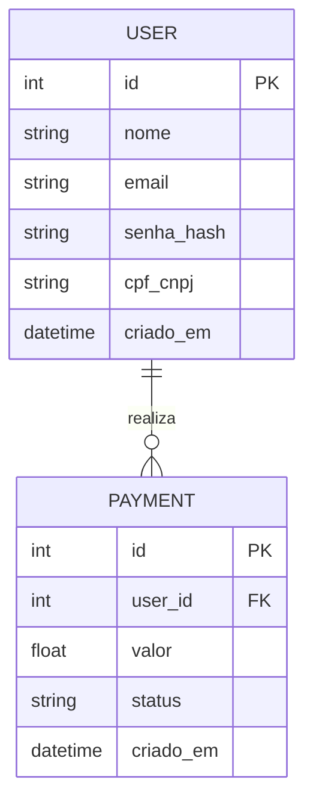
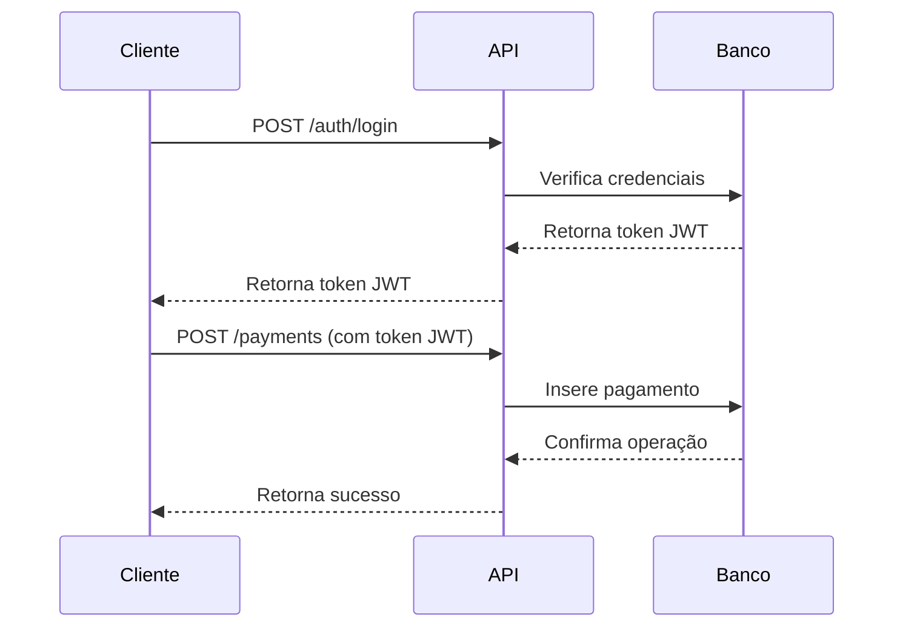

# Controle de Pagamentos - API

Este repositório contém um projeto de aplicação web para controle de pagamentos, desenvolvido em Python utilizando Flask ou FastAPI. A aplicação fornece um CRUD completo e utiliza MySQL ou um banco NoSQL. O sistema também conta com um ambiente Dockerizado para facilitar a implantação e os testes.

## Tecnologias Utilizadas

- **Linguagem:** Python 3.9+
- **Framework:** Flask ou FastAPI
- **Banco de Dados:** MySQL ou NoSQL (MongoDB, Firebase, etc.)
- **Gerenciamento de Dependências:** Poetry ou pip + requirements.txt
- **Conteinerização:** Docker, Docker Compose
- **Testes e API Client:** Postman

## Requisitos do Projeto

### Requisitos Funcionais

1. **Cadastro de Usuários**
   - Criar, listar, atualizar e excluir usuários.
   - Campos: Nome, Email, Senha (hash), CPF/CNPJ, Data de Criação.

2. **Cadastro de Pagamentos**
   - Criar, listar, atualizar e excluir pagamentos.
   - Campos: ID do Pagamento, ID do Usuário, Valor, Status (pendente, pago, cancelado), Data de Criação.

3. **Autenticação e Autorizacao**
   - Utilizar JWT para autenticação.
   - Permitir acesso apenas a usuários autenticados.

4. **Consulta de Transações**
   - Listagem de pagamentos filtrados por usuário, status e período.

5. **Registro de Logs**
   - Manter logs de todas as transações e atividades dos usuários.

### Requisitos Não Funcionais

1. **Clean Code e Boas Práticas**
   - Seguir padrões de desenvolvimento limpo e modular.
   - Utilização de PEP8.

2. **Banco de Dados**
   - Opções: MySQL ou NoSQL.
   - Criar scripts de inicialização.

3. **API RESTful**
   - Implementar endpoints seguindo padrões REST.

4. **Ambiente Dockerizado**
   - Criar um **Dockerfile** para a aplicação.
   - Criar um **Dockerfile** para o banco de dados.
   - Utilizar **docker-compose** para orquestração.

5. **Testes de API**
   - Criar um arquivo **collection.json** para ser importado no Postman.

## Estrutura do Projeto

```bash
controle-pagamentos/
|-- app/
|   |-- models/
|   |   |-- user.py
|   |   |-- payment.py
|   |-- routes/
|   |   |-- auth.py
|   |   |-- payments.py
|   |   |-- users.py
|   |-- services/
|   |-- utils/
|-- tests/
|-- database/
|   |-- init.sql  # Scripts de inicialização para MySQL
|-- docker/
|   |-- Dockerfile  # Dockerfile para a aplicação
|   |-- mysql.Dockerfile  # Dockerfile para MySQL
|-- docker-compose.yml
|-- requirements.txt
|-- README.md
```

## Diagramas

### Modelo de Dados (Exemplo para MySQL)



### Fluxo da API



## Como Rodar o Projeto

1. **Clone o repositório:**
   ```bash
   git clone https://github.com/seu-repositorio/controle-pagamentos.git
   cd controle-pagamentos
   ```
2. **Crie o arquivo `.env` e defina as variáveis de ambiente:**
   ```
   DB_HOST=db
   DB_USER=root
   DB_PASSWORD=admin
   DB_NAME=controle_pagamentos
   ```
3. **Construa e inicie os containers:**
   ```bash
   docker-compose up --build
   ```
4. **Acesse a API pelo Postman:**
   - Base URL: `http://localhost:8000`
   - Endpoints:
     - `POST /auth/login`
     - `POST /users`
     - `POST /payments`
     - `GET /payments`
     - `PUT /payments/{id}`
     - `DELETE /payments/{id}`

---

Esse projeto é um bom ponto de partida para o desenvolvimento de um sistema simples de controle de pagamentos seguindo boas práticas e padrões modernos.

